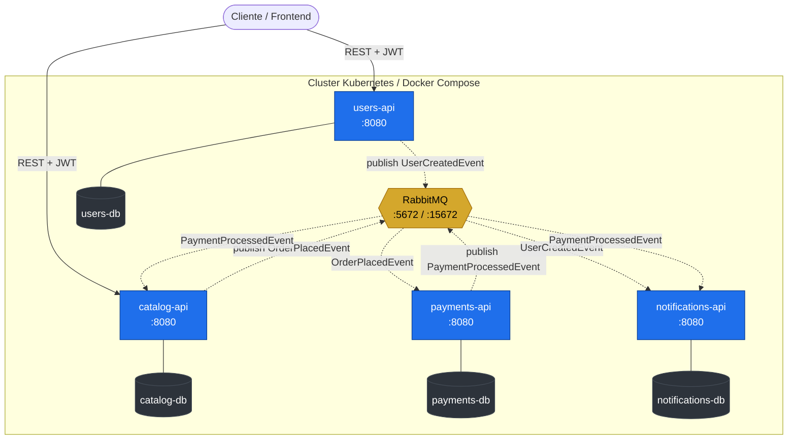
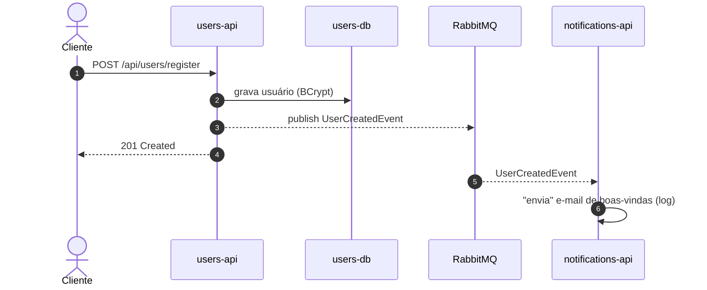
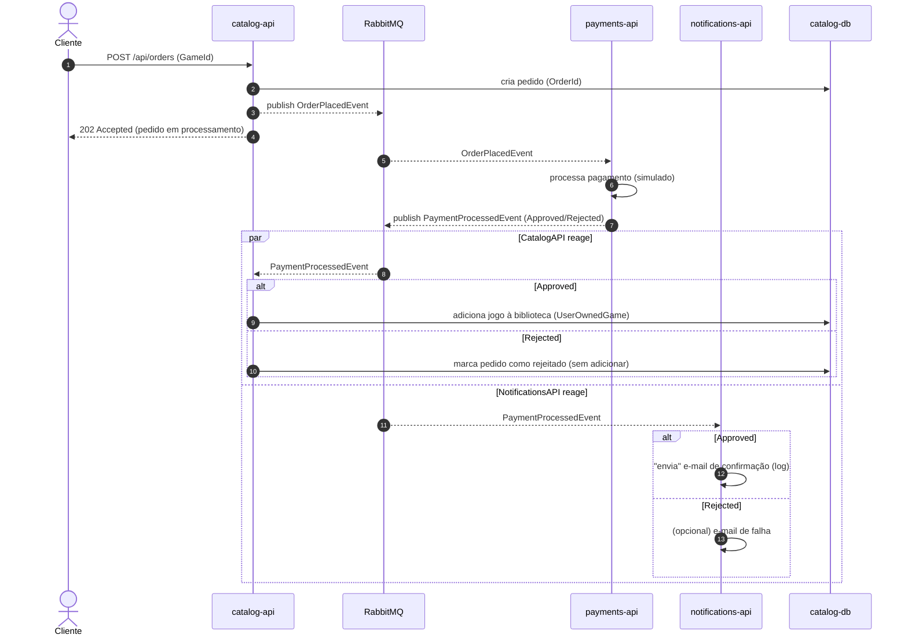
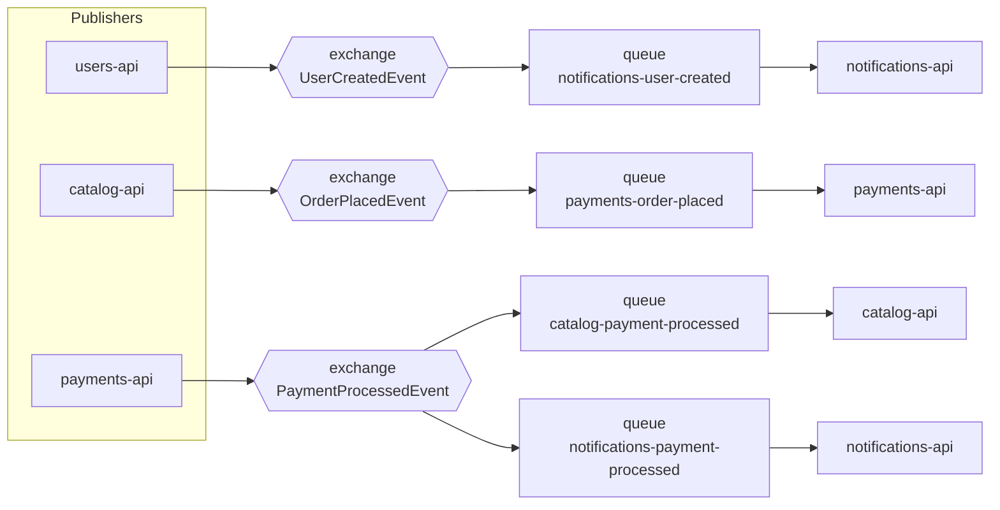
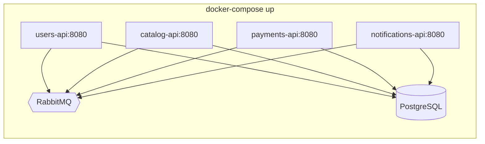
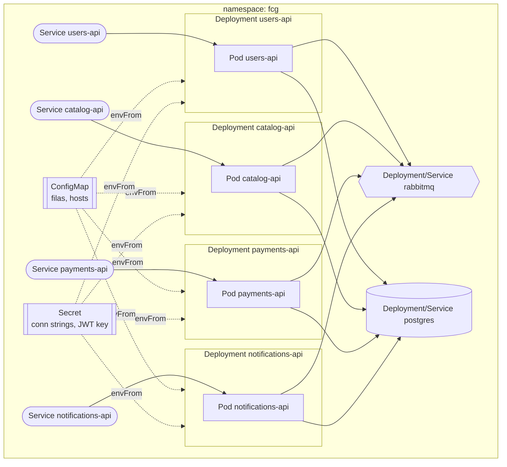

# Arquitetura — FIAP Cloud Games (FCG) · Fase 2

> **Parecer final de arquitetura** para a decomposição do monólito FCG (Fase 1) em uma arquitetura de microsserviços orientada a eventos, containerizada com Docker e orquestrada em Kubernetes, com mensageria assíncrona via RabbitMQ + MassTransit.
>
> Documento de referência para todos os times. Consolida o desenho da solução, os fluxos, a topologia de mensageria, as convenções padronizadas e o contrato dos eventos (`FCG.Contracts`).
>
> | | |
> |---|---|
> | **Versão** | 1.0 |
> | **Data** | 2026-06-10 |
> | **Base** | [`monolito-fiap-fase-1.md`](./monolito-fiap-fase-1.md) · [`TC NETT - Fase 2.md`](./TC%20NETT%20-%20Fase%202.md) |
> | **Status** | Proposto — aguardando aceite dos times para iniciar a base de orquestração |

---

## 1. Sumário executivo (o parecer)

A Fase 1 entregou um **monólito em camadas** (.NET 10, Minimal APIs, EF Core/PostgreSQL, JWT) com toda a comunicação **síncrona e in-process**. Para suportar pagamento e notificações sem aumentar acoplamento, a Fase 2 decompõe o sistema em **quatro microsserviços independentes** comunicando-se de forma **assíncrona por eventos**, mais **um quinto repositório de orquestração** que sobe tudo junto (Docker Compose e Kubernetes).

**Recomendações centrais deste parecer:**

1. **Autonomia total de código, contrato único de eventos.** Cada serviço é dono da sua stack, estrutura interna e banco. A **única** coisa que precisa ser idêntica entre os repositórios é o **contrato dos eventos de integração** — porque o MassTransit casa publisher e consumer por **namespace + nome da classe**. Divergência aqui faz a mensagem **sumir sem erro nenhum** (falha silenciosa). Solução: um pacote compartilhado **`FCG.Contracts`** (§5).
2. **RabbitMQ como broker, MassTransit como abstração.** O broker é detalhe de infraestrutura; os serviços só consomem via variável de ambiente (`RabbitMq__Host`). Não usar Kafka — o problema tem forma de *fila de trabalho/eventos de comando*, não de *streaming de alto volume*; Kafka seria overkill (ver [`04-Messageria.md §5.6`](../Resumos%20Fase%202/04-Messageria.md)).
3. **Um banco por serviço.** Cada microsserviço tem seu próprio PostgreSQL/contexto. Nada de banco compartilhado — isso recriaria o acoplamento que estamos eliminando.
4. **Quinto repositório de orquestração** (`fcg-orchestration`), dono da infraestrutura: Docker Compose, manifestos Kubernetes base, RabbitMQ, ConfigMaps e Secrets. **A entrega dele depende dos times**: ele só fecha quando cada serviço tiver **nome, porta, variáveis de ambiente e filas/eventos definidos** (§11).
5. **Idempotência obrigatória nos consumers.** A entrega é *at-least-once*; todo handler precisa tolerar reprocessamento (§9).

> **Decisão de escopo:** consistência **eventual** entre serviços é aceita e esperada. O fluxo de compra usa **coreografia de eventos** (cada serviço reage ao evento anterior), não um orquestrador central/Saga — é suficiente para o escopo da Fase 2 e mais simples de operar. A compensação (pagamento rejeitado) é tratada pela ausência de efeito: nada é adicionado à biblioteca.

---

## 2. Visão geral da arquitetura

### 2.1 Os repositórios

| # | Repositório | Service (k8s) | Responsabilidade | Origem na Fase 1 |
|---|---|---|---|---|
| 1 | `fcg-users-api` | `users-api` | Cadastro, autenticação (JWT) e autorização de usuários | `FCG.Domain.Users` + `Auth` |
| 2 | `fcg-catalog-api` | `catalog-api` | CRUD de jogos, promoções, biblioteca do usuário e **orquestração da compra** | `FCG.Domain.Games` + `UserOwnedGame` |
| 3 | `fcg-payments-api` | `payments-api` | Processar (simular) o pagamento de uma compra | **Novo** (sem equivalente) |
| 4 | `fcg-notifications-api` | `notifications-api` | "Enviar" e-mails de boas-vindas e de confirmação (log) | **Novo** (sem equivalente) |
| 5 | `fcg-orchestration` | — | Infra: Docker Compose, k8s base, RabbitMQ, ConfigMaps/Secrets, README principal | **Novo** (infra) |
| — | `fcg-contracts` | — | Biblioteca compartilhada com **as 3 classes de evento** | **Novo** (contrato) |

> Os repositórios 1–4 já existem como pastas neste workspace (`fcg-users-api/`, `fcg-catalog-api/`, `fcg-payments-api/`, `fcg-notifications-api/`). `fcg-contracts` e `fcg-orchestration` são novos.

### 2.2 Diagrama de contexto (serviços, broker e bancos)



**Legenda:** linha cheia = chamada síncrona REST; linha tracejada = evento assíncrono via broker. Cada serviço é dono exclusivo do seu banco.

### 2.3 Decomposição interna (cada serviço mantém Clean Architecture)

Cada microsserviço é **independente na estrutura** — não há obrigação de espelhar camadas entre repos. A recomendação (herdada da Fase 1, opcional) é manter Clean Architecture leve por serviço:

```
fcg-<service>/
├── src/
│   ├── <Service>.Domain/          # entidades, VOs, regras
│   ├── <Service>.Application/      # casos de uso, handlers de evento
│   ├── <Service>.Infrastructure/   # EF Core, repositórios, MassTransit, JWT
│   └── <Service>.API/              # Minimal API, Program.cs, porta 8080
├── k8s/                            # manifestos (Deployment, Service, ConfigMap, Secret)
├── Dockerfile                      # multi-stage, na raiz
└── README.md                       # finalidade + variáveis de ambiente
```

---

## 3. Os serviços em detalhe

### 3.1 UsersAPI (`users-api`)

- **Responsabilidade:** cadastro de usuários, login (emissão de JWT) e autorização. É o **único emissor de tokens** do sistema.
- **REST (síncrono):** `POST /api/users/register`, `POST /api/auth/login`, gestão admin de usuários.
- **Eventos:** **publica** `UserCreatedEvent` ao concluir um cadastro.
- **Banco:** `users-db` (Users, Roles). Mantém BCrypt e o VO `Password` da Fase 1.
- **JWT:** dono do `JwtSettings__SecretKey`. Os demais serviços recebem **a mesma chave simétrica** para validar tokens (HS256).

### 3.2 CatalogAPI (`catalog-api`)

- **Responsabilidade:** CRUD de jogos e promoções (herdado de `FCG.Domain.Games`), biblioteca do usuário (`UserOwnedGame`) e **início/conclusão do fluxo de compra**.
- **REST (síncrono):** CRUD de jogos/promoções; `POST /api/orders` (inicia a compra → publica `OrderPlacedEvent`); `GET /api/users/{id}/library`.
- **Eventos:** **publica** `OrderPlacedEvent`; **consome** `PaymentProcessedEvent` (se `Approved`, adiciona o jogo à biblioteca).
- **Banco:** `catalog-db` (Games, GamePromotions, UserOwnedGames).
- **JWT:** valida tokens (consome `JwtSettings__SecretKey`).

### 3.3 PaymentsAPI (`payments-api`)

- **Responsabilidade:** processar (simular) o pagamento de uma compra. Serviço novo.
- **REST (síncrono):** opcional — endpoint de health/consulta de pagamentos. O caminho principal é **100% por evento**.
- **Eventos:** **consome** `OrderPlacedEvent`; processa (regra simulada — ver abaixo) e **publica** `PaymentProcessedEvent` com `Status = Approved | Rejected`.
- **Banco:** `payments-db` (histórico de pagamentos / dedup de `OrderId`).
- **Regra de simulação sugerida:** aprovar por padrão, com regra determinística para permitir demonstrar o caminho de rejeição (ex.: `Price > limite` ou um flag de teste → `Rejected`).

### 3.4 NotificationsAPI (`notifications-api`)

- **Responsabilidade:** "enviar" e-mails (simulado, logando no console). Serviço novo, **somente consumidor** — não expõe REST de negócio.
- **Eventos:** **consome** `UserCreatedEvent` (e-mail de boas-vindas) e `PaymentProcessedEvent` (se `Approved`, e-mail de confirmação de compra).
- **Banco:** `notifications-db` (opcional — log de notificações enviadas / dedup). Pode operar stateless se a dedup for in-memory, mas recomenda-se persistir para idempotência real.

---

## 4. Matriz de eventos (publish / consume)

| Evento | Publicado por | Consumido por | Disparo |
|---|---|---|---|
| `UserCreatedEvent` | **users-api** | notifications-api | Após cadastro de usuário |
| `OrderPlacedEvent` | **catalog-api** | payments-api | Após `POST /api/orders` |
| `PaymentProcessedEvent` | **payments-api** | catalog-api, notifications-api | Após processar o pagamento |

> ⚠️ **Ponto crítico de integração:** o MassTransit publica em um *exchange* nomeado pelo **tipo da mensagem** (`Namespace:NomeDaClasse`). Se `users-api` publicar `FCG.Contracts.Events.UserCreatedEvent` e `notifications-api` consumir uma classe com o mesmo nome em **outro namespace**, o binding não casa e a **mensagem é descartada silenciosamente**. Por isso os três contratos **vêm do mesmo assembly** (`FCG.Contracts`) — ver §5.

---

## 5. `FCG.Contracts` — o contrato compartilhado

### 5.1 Por que existe

Os serviços são independentes em tudo, **exceto no formato dos eventos de integração**. Copiar e colar as classes à mão entre repos é a receita para divergência silenciosa. A solução é um **projeto compartilhado mínimo**, contendo **apenas as 3 classes de evento**, no namespace fixo `FCG.Contracts.Events`, referenciado por todos os repositórios que publicam ou consomem.

> **Regra de ouro:** `FCG.Contracts` contém **só os contratos** — nada de lógica, dependências de EF, MassTransit ou regras de negócio. É um pacote "POCO" puro, para que qualquer serviço o referencie sem arrastar acoplamento.

### 5.2 Distribuição (decisão de arquitetura)

| Opção | Como funciona | Recomendação |
|---|---|---|
| **NuGet em GitHub Packages** | `FCG.Contracts` publica um pacote versionado; cada repo faz `PackageReference` | ✅ **Recomendado** — versionamento explícito (SemVer), reprodutível no CI, sem submódulos |
| Git submodule | Cada repo inclui `FCG.Contracts` como submódulo e referencia o `.csproj` | Alternativa simples, porém frágil em CI/Docker |
| Cópia manual | Classes duplicadas | ❌ **Proibido** — é exatamente o problema que estamos resolvendo |

**Versionamento:** mudança **aditiva** (campo novo opcional) → *minor*; mudança **quebra-contrato** (renomear/remover campo, mudar namespace/nome de classe) → *major* e **alinhamento coordenado entre todos os times** antes do merge.

### 5.3 Os três contratos (proposta)

`records` imutáveis, sem dependências externas. Namespace **`FCG.Contracts.Events`** (não alterar — é o que o MassTransit usa para rotear).

```csharp
namespace FCG.Contracts.Events;

public record UserCreatedEvent(
    Guid UserId,
    string Name,
    string Email,
    DateTime OccurredAt);

public record OrderPlacedEvent(
    Guid OrderId,
    Guid UserId,
    Guid GameId,
    decimal Price,
    DateTime OccurredAt);

public record PaymentProcessedEvent(
    Guid OrderId,
    Guid UserId,
    Guid GameId,
    decimal Price,
    PaymentStatus Status,
    DateTime ProcessedAt);

public enum PaymentStatus
{
    Approved = 1,
    Rejected = 2
}
```

> **`OrderId` é o correlation id do fluxo de compra.** Ele nasce no `catalog-api` (no `OrderPlacedEvent`), atravessa o `payments-api` e volta no `PaymentProcessedEvent`. É a chave que `catalog-api` e `notifications-api` usam para idempotência e para casar a resposta ao pedido original.

### 5.4 ADR — Contratos compartilhados *vs.* independência dos serviços

> **Decisão registrada** em resposta à crítica: *"uma biblioteca compartilhada não deixa os serviços totalmente independentes, logo não seria boa prática"*.

**Contexto.** Questionou-se se `FCG.Contracts` fere o princípio de independência dos microsserviços, por introduzir uma dependência comum a todos os repositórios.

**A distinção que resolve a questão.** Independência em microsserviços significa **ciclo de vida independente** — deploy, escala, versão e *propriedade do dado* separados. **Não** significa "ausência de qualquer acordo compartilhado". No instante em que um serviço publica um evento e outro o consome, ambos **obrigatoriamente** concordam sobre o formato da mensagem. Esse acoplamento é **intrínseco à comunicação** e existe independentemente da forma de implementação. A decisão não é *se* haverá acoplamento no contrato — é *como* expressá-lo:

| Forma de expressar o contrato | Independência de **código** | Risco principal |
|---|---|---|
| Cada serviço **copia a classe na mão** | Total | **Divergência silenciosa** — campo muda, ninguém compila erro, a mensagem some |
| **Biblioteca compartilhada** (`FCG.Contracts`) | Acoplamento **apenas no contrato** | Baixo — desde que contenha **só** contratos POCO |
| **Schema-first** (JSON Schema/Avro) + geração por serviço | Total (poliglota) | Médio — mais maquinário; exige *contract testing* |

A opção "copiar na mão" parece mais independente, mas apenas no binário: troca um acoplamento **explícito e verificado pelo compilador** por um **implícito e perigoso**. Como o MassTransit roteia por **namespace + nome de classe**, uma divergência não gera erro — a mensagem é **descartada em silêncio**. O acoplamento não foi eliminado; foi tornado invisível.

**Onde a crítica procede.** Se `FCG.Contracts` crescer para conter lógica de negócio, modelos de domínio ou helpers, vira um *shared kernel* e o sistema degenera em **monólito distribuído** — aí sim é anti-padrão. **Mitigação (já adotada):** o pacote contém exclusivamente as 3 classes de evento (`record` POCO), **sem** dependências de EF, MassTransit ou regras. Compartilhar o **contrato publicado** de um evento é a fronteira aceitável; compartilhar **modelo de domínio** é o que a literatura (ex.: Sam Newman, *Building Microservices*) condena — e isso permanece proibido.

**Alternativa desacoplada (registrada para o futuro).** Caso o sistema passe a ter serviços **poliglotas** (ex.: um serviço em Node/Python) ou times/organizações separados, migrar para:
1. **Schema-first**: evento definido em JSON Schema; cada serviço gera/escreve sua própria classe.
2. **MassTransit `SetEntityName` / message topology**: desacopla o roteamento do nome CLR, permitindo que classes em namespaces diferentes roteiem para o mesmo exchange — resolve a objeção diretamente.
3. **Contract testing** (estilo Pact) no CI para detectar quebras sem o artefato compartilhado.

Custo dessa via: mais configuração e disciplina, e o "single source of truth" sai de um artefato compilado (validado pelo compilador) para um schema + convenção documentada (validados por teste).

**Decisão.** **Manter `FCG.Contracts`** como pacote puro de contratos, versionado (SemVer). Justificativa: stack 100% .NET 10, time único, prazo de fase, e roteamento do MassTransit por tipo CLR — combinação em que a biblioteca compartilhada é o caminho de **menor risco** e padrão **aceito** (recomendado pela própria documentação do MassTransit). A migração para schema-first só se justifica sob poliglotismo real ou separação organizacional — fora do escopo da Fase 2.

---

## 6. Fluxos orientados a eventos

### 6.1 Fluxo de cadastro de usuário



**Nota:** o `users-api` responde ao cliente **sem esperar** a notificação. O e-mail é eventual.

### 6.2 Fluxo de compra de jogo (coreografia)



**Pontos de projeto:**

- `catalog-api` responde **`202 Accepted`** ao iniciar a compra — a conclusão é assíncrona. O cliente consulta `GET /api/users/{id}/library` ou o status do pedido depois.
- `PaymentProcessedEvent` é consumido por **dois** serviços independentes (catalog e notifications). No RabbitMQ/MassTransit isso é um **fanout por tipo**: cada consumer tem sua própria fila ligada ao exchange do evento, recebendo sua cópia.
- A "compensação" de um pagamento rejeitado é **não adicionar** o jogo — não há efeito a desfazer, então não precisamos de Saga aqui.

---

## 7. Topologia de mensageria (RabbitMQ + MassTransit)

### 7.1 Como o MassTransit mapeia para o RabbitMQ

Para cada **tipo de mensagem**, o MassTransit cria um **exchange fanout** nomeado pelo tipo (`FCG.Contracts.Events:UserCreatedEvent`). Para cada **consumer**, cria uma **fila** (receive endpoint) com um exchange próprio, ligado (binding) ao exchange do tipo. Resultado: publicar uma vez entrega a **todas** as filas interessadas.



### 7.2 Nomes de filas e exchange (para o ConfigMap)

Estes nomes vão para o **ConfigMap** mantido pela orquestração. Convenção: `<serviço-consumidor>-<evento-em-kebab>`.

| Fila (receive endpoint) | Serviço consumidor | Evento |
|---|---|---|
| `notifications-user-created` | notifications-api | `UserCreatedEvent` |
| `payments-order-placed` | payments-api | `OrderPlacedEvent` |
| `catalog-payment-processed` | catalog-api | `PaymentProcessedEvent` |
| `notifications-payment-processed` | notifications-api | `PaymentProcessedEvent` |

> **MassTransit + filas explícitas:** configurar cada consumer com `ReceiveEndpoint("<nome-da-fila>")` usando o valor vindo da configuração (`RabbitMq__Queues__*`), em vez de deixar o nome automático. Isso garante que o nome da fila seja **previsível e idêntico** ao do ConfigMap.

### 7.3 Confiabilidade (configuração mínima de produção)

- **Filas duráveis** + mensagens persistentes (padrão do MassTransit em RabbitMQ).
- **Retry** com backoff exponencial no consumer (ex.: 3 tentativas) via `UseMessageRetry`.
- **Dead-Letter Queue** automática do MassTransit (`_skipped`/`_error`) — monitorar profundidade > 0 como incidente.
- **Prefetch** ajustado por consumer para distribuição justa entre réplicas.

---

## 8. Persistência — um banco por serviço

| Serviço | Banco | Principais tabelas | Connection string (env) |
|---|---|---|---|
| users-api | `users-db` (PostgreSQL) | Users, Roles | `ConnectionStrings__Default` |
| catalog-api | `catalog-db` (PostgreSQL) | Games, GamePromotions, UserOwnedGames, Orders | `ConnectionStrings__Default` |
| payments-api | `payments-db` (PostgreSQL) | Payments (dedup por OrderId) | `ConnectionStrings__Default` |
| notifications-api | `notifications-db` (PostgreSQL) | Notifications (log/dedup) | `ConnectionStrings__Default` |

- O schema único da Fase 1 (`Users`, `Roles`, `UserOwnedGames`, `Games`, `GamePromotions`) é **dividido** entre `users-db` e `catalog-db`.
- Migrations aplicadas no startup de cada serviço (com retry, como já feito na Fase 1) — cada serviço migra **apenas seu** banco.
- No Compose, pode-se usar **uma instância PostgreSQL com múltiplos databases** (simplicidade local) ou um container por banco. Em k8s, recomenda-se um Deployment/StatefulSet de Postgres por serviço (ou um Postgres gerenciado por banco). Para o escopo da Fase 2, **uma instância com 4 databases** é aceitável e mais leve.

---

## 9. Padrões transversais

| Padrão | Onde | Por quê |
|---|---|---|
| **Idempotent Consumer** | Todos os consumers | Entrega é *at-least-once*; o mesmo evento pode chegar 2×. Guardar `OrderId`/`MessageId` já processado e ignorar repetição. |
| **Outbox** | users-api, catalog-api, payments-api (publishers) | Evita *dual write* (gravou no banco mas caiu antes de publicar). MassTransit tem **Outbox nativo com EF Core** — habilitar. |
| **Retry + DLQ** | Todos os consumers | Tolera falhas transitórias; isola *poison messages*. |
| **JWT compartilhado (HS256)** | users-api emite; catalog/payments validam | Mesma `SecretKey` em todos via Secret. `ValidateIssuer/Audience = false`, `ValidateLifetime = true` (igual Fase 1). |
| **Correlation Id** | `OrderId` no fluxo de compra | Rastreabilidade e idempotência ponta a ponta. |

> **Idempotência é inegociável.** Sem ela, uma duplicata no fluxo de compra pode adicionar o jogo duas vezes ou enviar dois e-mails. A entidade `UserOwnedGame` da Fase 1 já tem a regra "usuário não pode possuir o mesmo jogo duas vezes" (`UserAlreadyOwnsGameException`) — isso já é uma rede de proteção natural no `catalog-api`.

---

## 10. Convenções padronizadas (contrato de plataforma)

Padrões **obrigatórios** em todos os repositórios de serviço, para que a orquestração "plugue" tudo sem ajustes manuais:

| Item | Padrão |
|---|---|
| **Runtime** | .NET 10 em todos |
| **Porta do container** | App escutando em **8080** dentro do container |
| **Dockerfile** | Multi-stage, na **raiz** de cada repo (template fornecido pela orquestração) |
| **Manifestos k8s** | Pasta **`/k8s`** na raiz de cada repo (template fornecido) |
| **Nome do Service (k8s)** | `users-api`, `catalog-api`, `payments-api`, `notifications-api` — é por esse nome que um serviço acha o outro (ex.: `http://payments-api`) |
| **Conexão de banco** | `ConnectionStrings__Default` |
| **Host do RabbitMQ** | `RabbitMq__Host` |
| **Filas / exchange** | Definidos em conjunto e colocados no **ConfigMap** (§7.2) |
| **Segredos** | Connection strings e `JwtSettings__SecretKey` em **Secret** |
| **Config não sensível** | Nomes de fila, URLs de serviço em **ConfigMap** |
| **README** | Cada repo descreve finalidade + variáveis de ambiente |

### 10.1 Variáveis de ambiente por serviço

| Variável | users-api | catalog-api | payments-api | notifications-api | Origem |
|---|:---:|:---:|:---:|:---:|---|
| `ConnectionStrings__Default` | ✅ | ✅ | ✅ | ✅ | Secret |
| `RabbitMq__Host` | ✅ | ✅ | ✅ | ✅ | ConfigMap |
| `JwtSettings__SecretKey` | ✅ | ✅ | ✅ | — | Secret |
| `JwtSettings__ExpirationHours` | ✅ | — | — | — | ConfigMap |
| `RabbitMq__Queues__*` (nomes de fila) | — | ✅ | ✅ | ✅ | ConfigMap |
| `ASPNETCORE_ENVIRONMENT` | ✅ | ✅ | ✅ | ✅ | ConfigMap |

---

## 11. O 5º repositório — Orquestração (`fcg-orchestration`)

> **Esta seção registra formalmente a proposta do repositório de orquestração e sua dependência dos demais times.**

### 11.1 Finalidade

O `fcg-orchestration` concentra **toda a responsabilidade de infraestrutura**, mantendo os repositórios de serviço focados só no seu domínio. É o repositório que sobe **tudo junto** — primeiro com Docker Compose (dev local) e depois no Kubernetes.

**Conteúdo:**

```
fcg-orchestration/
├── docker-compose.yml          # sobe os 4 serviços + RabbitMQ + Postgres
├── .env.example                # variáveis para o Compose
├── k8s/
│   ├── rabbitmq/               # Deployment + Service do broker
│   ├── postgres/               # Deployment(s) + Service(s) + PVC
│   ├── configmap.yaml          # nomes de fila/exchange, hosts, env não sensível
│   ├── secret.yaml             # connection strings, JwtSettings__SecretKey
│   ├── users-api/              # Deployment + Service
│   ├── catalog-api/
│   ├── payments-api/
│   └── notifications-api/
├── templates/
│   ├── Dockerfile.template     # modelo multi-stage entregue aos times
│   └── k8s-service.template/   # modelo da pasta /k8s de cada serviço
└── README.md                   # como rodar com Docker e como fazer deploy no k8s
```

> **Observação sobre os manifestos.** O desafio pede a pasta `/k8s` na raiz **de cada repositório de serviço**. A orquestração mantém os manifestos **de infra** (RabbitMQ, Postgres, ConfigMap, Secret) e os **templates**; cada time mantém o `Deployment`/`Service` do seu serviço na sua própria `/k8s`. A orquestração também pode manter uma **cópia agregada** dos manifestos para o `kubectl apply -f .` único da demonstração.

### 11.2 Componentes de infraestrutura padronizados

- **RabbitMQ** sobe no Compose e no k8s (imagem `rabbitmq:3-management`, portas 5672/15672). Os times **só consomem** via `RabbitMq__Host` — não precisam se preocupar com a infra do broker.
- **PostgreSQL** para os bancos dos serviços.
- **ConfigMap** com nomes de fila/exchange e hosts.
- **Secret** com connection strings e a chave JWT compartilhada.
- **Service discovery** por nome de Service do k8s (`http://payments-api`, etc.).

### 11.3 Dependência dos times (bloqueio)

⚠️ **A orquestração só fecha depois que cada serviço estiver definido.** Quanto antes o contrato de plataforma for acertado, mais tranquilo é juntar tudo no fim. De **cada time**, a orquestração precisa de:

1. **Nome do serviço e porta** (porta interna já padronizada em 8080).
2. **Variáveis de ambiente** que o serviço usa.
3. **Quais eventos publica e consome** (e, por consequência, os nomes de fila).

### 11.4 Cronograma proposto (entregas da orquestração aos times)

A orquestração entrega esta semana, para destravar os times:

- ✅ `FCG.Contracts` pronto (as 3 classes de evento) + link.
- ✅ Template de `Dockerfile` multi-stage.
- ✅ Template da pasta `/k8s`.
- ✅ README com as convenções (este documento consolida as decisões; o README operacional vive no `fcg-orchestration`).

**Próximo passo / aceite:** se os times concordam com os padrões da §10, a orquestração inicia a montagem da base imediatamente. Ajustes pontuais podem ser feitos depois sem retrabalho estrutural.

---

## 12. Containerização (Docker)

- **Dockerfile multi-stage** na raiz de cada repo: `mcr.microsoft.com/dotnet/sdk:10.0` (restore/build/publish) → `mcr.microsoft.com/dotnet/aspnet:10.0` (runtime), expondo **8080**.
- **`docker-compose.yml`** (no `fcg-orchestration`) permite `docker-compose up` subindo a aplicação completa: RabbitMQ + Postgres + os 4 serviços, com `depends_on`/healthchecks (broker e banco saudáveis antes dos serviços).



---

## 13. Orquestração com Kubernetes

Requisitos obrigatórios do desafio, atendidos assim:

| Recurso | Uso | Obrigatório? |
|---|---|---|
| **Deployment** | Um por serviço (gerencia os Pods; nada de Pod isolado) | ✅ Sim |
| **Service** | Um por serviço, nomeado `*-api` para descoberta interna | ✅ (comunicação `http://payments-api`) |
| **ConfigMap** | Nomes de fila/tópico, URLs de serviço, env não sensível | ✅ Sim |
| **Secret** | Connection strings, `JwtSettings__SecretKey` | ✅ Sim |



**Deploy local validado** em cluster Kubernetes local (Kind, Minikube, k3d ou Docker Desktop): `kubectl apply -f .` e `kubectl get pods` mostrando todos os Pods `Running`.

---

## 14. Segurança — JWT entre serviços

- O **users-api** é o **único emissor** de tokens (login → JWT HS256, claims de papel como na Fase 1).
- `catalog-api` e `payments-api` **validam** o token usando a **mesma `SecretKey`** (HS256, chave simétrica), distribuída via **Secret**. Configuração igual à Fase 1: `ValidateIssuer = false`, `ValidateAudience = false`, `ValidateLifetime = true`, `RoleClaimType = ClaimTypes.Role`.
- `notifications-api` não expõe REST de negócio → não precisa validar JWT.

> **Evolução futura (fora do escopo da Fase 2):** migrar de chave simétrica compartilhada para **JWT assinado por chave assimétrica** (users-api assina com chave privada; demais validam com a pública via JWKS). Elimina o segredo compartilhado, mas adiciona complexidade desnecessária agora.

---

## 15. Mapeamento aos requisitos do desafio (checklist)

| Requisito (TC Fase 2) | Atendido por |
|---|---|
| 4 microsserviços em repositórios independentes | §2.1 |
| Fluxo de cadastro (`UserCreatedEvent`) | §6.1 |
| Fluxo de compra (`OrderPlacedEvent` → `PaymentProcessedEvent`) | §6.2 |
| Mensageria (RabbitMQ + MassTransit) | §7 |
| Dockerfile multi-stage por repo | §12 |
| `docker-compose up` sobe tudo | §12 |
| `/k8s` em cada repo | §3, §13 |
| Deployments (sem Pod isolado) | §13 |
| ConfigMaps (config não sensível) | §10.1, §13 |
| Secrets (dados sensíveis) | §10.1, §13, §14 |
| Comunicação por nome de Service (`http://payments-api`) | §10 |
| Deploy testado em cluster local | §13 |
| README por repo + README principal de orquestração | §3, §11 |
| 5º repositório de orquestração (opcional) | §11 |

---

## 16. Riscos e mitigações

| Risco | Impacto | Mitigação |
|---|---|---|
| Divergência de namespace/nome dos eventos | Mensagem some sem erro | `FCG.Contracts` como fonte única (§5) |
| Dual write (gravou, não publicou) | Pedido sem evento | Outbox do MassTransit (§9) |
| Duplicata de evento | Jogo/e-mail duplicado | Idempotent consumer + regra `UserAlreadyOwnsGame` (§9) |
| Orquestração travada esperando os times | Atraso na integração final | Definir cedo nome/porta/env/eventos (§11.3) |
| Chave JWT exposta | Comprometimento de auth | Secret no k8s; nunca no Git (§14) |
| DLQ enchendo sem ninguém ver | Perda silenciosa de dados | Monitorar profundidade da DLQ (§7.3) |

---

## 17. Conclusão do parecer

A arquitetura proposta atende integralmente aos requisitos da Fase 2 e resolve o gargalo do monólito: cada serviço escala e evolui de forma independente, a comunicação é assíncrona e resiliente, e a infraestrutura é declarativa e reprodutível (Compose + k8s).

A decisão arquitetural mais importante — e a de maior risco se ignorada — é o **contrato único de eventos via `FCG.Contracts`**. É o único ponto onde a autonomia dos times cede lugar a um acordo rígido, justamente porque o MassTransit casa publisher/consumer por namespace + nome de classe, e qualquer divergência aqui produz falha **silenciosa**.

O **5º repositório de orquestração** é recomendado e adotado: ele isola a infraestrutura e habilita o `docker-compose up` / `kubectl apply -f .` da demonstração. Sua entrega **depende dos times** fornecerem cedo nome, porta, variáveis de ambiente e eventos de cada serviço.

**Aceite:** com a concordância dos times quanto às convenções da §10, a base de orquestração e o `FCG.Contracts` podem ser iniciados imediatamente.
